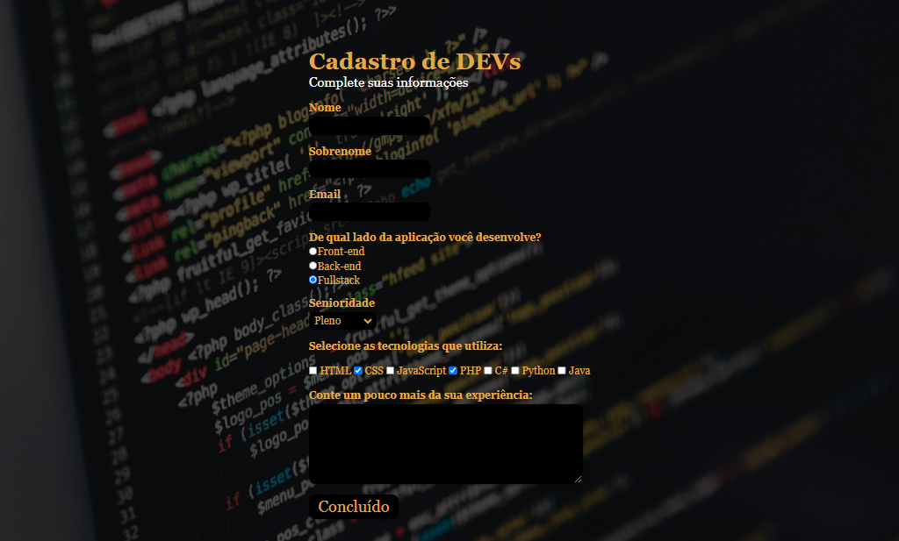
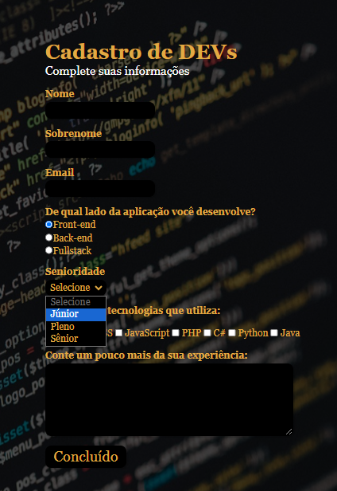

<h1 align="center" id="project_name">
    
  Formulário para Devs
   
  
   
</h1>

Esse projeto foi desenvolvido através do video da Rafaela Ballerini em seu canal no Youtube

<h2 id="about">
💻 Sobre o projeto
</h2>
Um dos meus primeiros formulários, utilizando apenas HTML e CSS. Feito seguindo o tutorial da Rafaela Ballerini.
 

Video aqui -->  **[Formulario-ByRafaBallerini](https://youtu.be/wwqOJ2o84S4?si=O6dkHyf4bz-Ykylb)**

<h2 id="layout">🎨 Layout</h2>

  

  
  

 
<h2 id="technologies">🛠 Tecnologias</h2>

As seguintes ferramentas foram usadas na construção do projeto:

- **[HTML](https://exemplo.com)**
- **[CSS](https://exemplo.com)**

> Veja o arquivo [Formulario-ByMaddu](https://maddusilva.github.io/formulario/)

**Utilitários**

- Editor: **[Visual Studio Code](https://code.visualstudio.com/)**
- Hospedagem: **[GitHub Pages](https://pages.github.com/)**
- Fontes: **font-family: Georgia, 'Times New Roman', Times, serif;**

<h2 id="author">🦸 Autor</h2>
<a href="#">

 <b> Maria Eduarda da Silva </b></a>

 <h2 id="author">Social</h2>
<a href="#">

 

 

*Made with love ♡ by Maddu* 👋🏽 [Entre em contato!](https://www.linkedin.com/in/maddusilvadev/)

